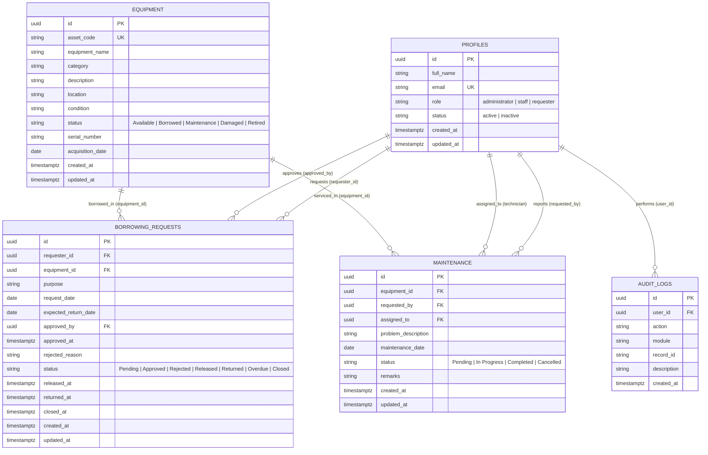
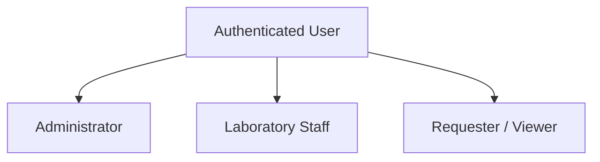
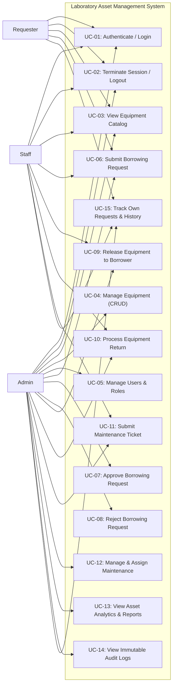
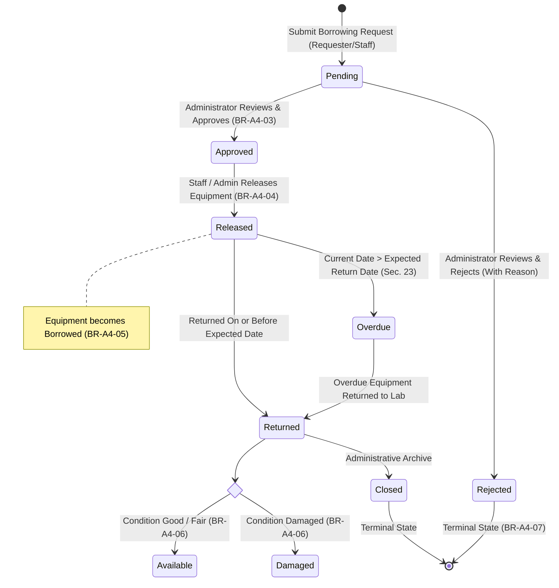

# Entity-Relationship Diagram (ERD) Specification

## Systems Analysis and Design — Laboratory 4, Section A
### Role-Based Asset Transaction and Approval Management

---

## 1. Architectural ERD Overview

The Laboratory Asset and Service Management System database model is implemented on **PostgreSQL / Supabase**. It features strict referential integrity, check constraints, Row Level Security (RLS) policies, and atomic transaction triggers.



---

## 2. Table Schemas and Cardinalities

### 2.1 Table: `profiles`
Stores application-level user attributes linked directly to Supabase Auth `auth.users.id`.

| Field Name | Data Type | Constraints | Description |
| :--- | :--- | :--- | :--- |
| `id` | UUID | PRIMARY KEY, REFERENCES `auth.users(id)` ON DELETE CASCADE | Unique identifier matching authentication record |
| `full_name` | TEXT | NOT NULL | User's complete legal name |
| `email` | TEXT | NOT NULL, UNIQUE | Institutional email address used for credentials |
| `role` | TEXT | NOT NULL, CHECK (`role IN ('administrator', 'staff', 'requester')`) | RBAC role determining permissions |
| `status` | TEXT | NOT NULL, DEFAULT `'active'`, CHECK (`status IN ('active', 'inactive')`) | Account operational state |
| `created_at` | TIMESTAMPTZ | NOT NULL, DEFAULT `now()` | Record creation timestamp |
| `updated_at` | TIMESTAMPTZ | NOT NULL, DEFAULT `now()` | Record modification timestamp |

### 2.2 Table: `equipment`
Maintains hardware assets and laboratory equipment catalog.

| Field Name | Data Type | Constraints | Description |
| :--- | :--- | :--- | :--- |
| `id` | UUID | PRIMARY KEY, DEFAULT `gen_random_uuid()` | Surrogate unique identifier |
| `asset_code` | TEXT | NOT NULL, UNIQUE | University asset tracking code (e.g. `LAP-001`, `PRJ-001`) |
| `equipment_name`| TEXT | NOT NULL | Commercial model name and hardware specs |
| `category` | TEXT | NOT NULL | Classification (`Laptops`, `Projectors`, `Monitors`, etc.) |
| `description` | TEXT | NULLABLE | Detailed specs and included accessories |
| `location` | TEXT | NOT NULL | Physical cabinet, shelf, or laboratory room location |
| `condition` | TEXT | NOT NULL, DEFAULT `'Good'` | Physical wear state (`Good`, `Fair`, `Poor`, `Damaged`) |
| `status` | TEXT | NOT NULL, DEFAULT `'Available'`, CHECK (`status IN ('Available', 'Borrowed', 'Maintenance', 'Damaged', 'Retired')`) | Transactional state for borrowing availability |
| `serial_number` | TEXT | NULLABLE | Manufacturer serial number |
| `acquisition_date`| DATE | DEFAULT `CURRENT_DATE` | Procurement date |
| `created_at` | TIMESTAMPTZ | NOT NULL, DEFAULT `now()` | System timestamp |
| `updated_at` | TIMESTAMPTZ | NOT NULL, DEFAULT `now()` | System timestamp |

### 2.3 Table: `borrowing_requests`
Encapsulates transaction state-machine for borrowing, approval, release, and return.

| Field Name | Data Type | Constraints | Description |
| :--- | :--- | :--- | :--- |
| `id` | UUID | PRIMARY KEY, DEFAULT `gen_random_uuid()` | Transaction identifier |
| `requester_id` | UUID | NOT NULL, REFERENCES `profiles(id)` ON DELETE RESTRICT | Account requesting the asset |
| `equipment_id` | UUID | NOT NULL, REFERENCES `equipment(id)` ON DELETE RESTRICT | Target equipment asset |
| `purpose` | TEXT | NOT NULL | Academic/research rationale |
| `request_date` | DATE | NOT NULL, DEFAULT `CURRENT_DATE` | Submission date |
| `expected_return_date` | DATE | NOT NULL | Anticipated return date |
| `approved_by` | UUID | NULLABLE, REFERENCES `profiles(id)` ON DELETE SET NULL | Administrator who authorized request |
| `approved_at` | TIMESTAMPTZ | NULLABLE | Approval timestamp |
| `rejected_reason` | TEXT | NULLABLE | Mandatory reason when status is Rejected |
| `status` | TEXT | NOT NULL, DEFAULT `'Pending'`, CHECK (`status IN ('Pending', 'Approved', 'Rejected', 'Released', 'Returned', 'Overdue', 'Closed')`) | State machine position |
| `released_at` | TIMESTAMPTZ | NULLABLE | Timestamp when equipment handed over |
| `returned_at` | TIMESTAMPTZ | NULLABLE | Timestamp when equipment returned to lab |
| `closed_at` | TIMESTAMPTZ | NULLABLE | Final archive timestamp |
| `created_at` | TIMESTAMPTZ | NOT NULL, DEFAULT `now()` | System timestamp |
| `updated_at` | TIMESTAMPTZ | NOT NULL, DEFAULT `now()` | System timestamp |

### 2.4 Table: `maintenance`
Tracks equipment maintenance, repair tickets, and technician work orders.

| Field Name | Data Type | Constraints | Description |
| :--- | :--- | :--- | :--- |
| `id` | UUID | PRIMARY KEY, DEFAULT `gen_random_uuid()` | Work order identifier |
| `equipment_id` | UUID | NOT NULL, REFERENCES `equipment(id)` ON DELETE RESTRICT | Serviced equipment asset |
| `requested_by` | UUID | NOT NULL, REFERENCES `profiles(id)` ON DELETE RESTRICT | Person reporting fault |
| `assigned_to` | UUID | NULLABLE, REFERENCES `profiles(id)` ON DELETE SET NULL | Assigned staff/technician |
| `problem_description` | TEXT | NOT NULL | Diagnosis or fault symptoms |
| `maintenance_date`| DATE | NOT NULL, DEFAULT `CURRENT_DATE` | Date ticket opened |
| `status` | TEXT | NOT NULL, DEFAULT `'Pending'`, CHECK (`status IN ('Pending', 'In Progress', 'Completed', 'Cancelled')`) | Maintenance lifecycle state |
| `remarks` | TEXT | NULLABLE | Technician diagnostic and repair notes |
| `created_at` | TIMESTAMPTZ | NOT NULL, DEFAULT `now()` | System timestamp |
| `updated_at` | TIMESTAMPTZ | NOT NULL, DEFAULT `now()` | System timestamp |

### 2.5 Table: `audit_logs`
Immutable append-only audit trail recording all sensitive operations.

| Field Name | Data Type | Constraints | Description |
| :--- | :--- | :--- | :--- |
| `id` | UUID | PRIMARY KEY, DEFAULT `gen_random_uuid()` | Audit log identifier |
| `user_id` | UUID | NULLABLE, REFERENCES `profiles(id)` ON DELETE SET NULL | Authenticated user responsible |
| `action` | TEXT | NOT NULL | Action opcode (e.g. `APPROVED`, `RELEASED`) |
| `module` | TEXT | NOT NULL | Subsystem (`Borrowing`, `Equipment`, etc.) |
| `record_id` | TEXT | NULLABLE | Affected entity record key |
| `description` | TEXT | NOT NULL | Human-readable audit narrative |
| `created_at` | TIMESTAMPTZ | NOT NULL, DEFAULT `now()` | Tamper-evident timestamp |

---

## 3. Referential Cardinalities and Business Integrity

1. **`profiles` to `borrowing_requests` (1:N)**:
   - A requester can submit multiple borrowing requests over time.
   - An administrator can approve multiple borrowing requests.
2. **`equipment` to `borrowing_requests` (1:N)**:
   - An equipment asset can be borrowed across multiple historical transactions, but only one active transaction (`Released` or `Overdue`) can exist concurrently (enforced by BR-A4-01 & BR-A4-05).
3. **`equipment` to `maintenance` (1:N)**:
   - An equipment asset can undergo multiple maintenance cycles over its operational lifetime.
4. **`profiles` to `audit_logs` (1:N)**:
   - Every sensitive administrative, staff, and requester transaction links to the acting user's profile.

# Use Case Specification

## Systems Analysis and Design — Laboratory 4, Section A
### Role-Based Asset Transaction and Approval Management

---

## 1. Actor Hierarchy



### 1.1 Actor Definitions

1. **Administrator (`administrator`)**:
   Responsible for executive laboratory governance, user account provisioning, equipment procurement, official borrowing authorizations (approvals and rejections), work order assignments, audit trail monitoring, and system metrics inspection.
2. **Laboratory Staff (`staff`)**:
   Responsible for daily operational handovers: equipment catalog verification, dispatching physically approved equipment (`Release`), inspecting returned hardware and assessing wear/damage (`Return`), and flagging defective assets (`Maintenance`).
3. **Requester / Viewer (`requester`)**:
   Students, faculty, or researchers who browse available equipment, submit borrowing requests for academic coursework, track live approval statuses, and review personal borrowing histories.

---

## 2. Use Case Diagram



---

## 3. Detailed Use Case Specifications

### UC-07: Approve Borrowing Request
- **Primary Actor**: Administrator
- **Preconditions**:
  1. Administrator is authenticated.
  2. Borrowing request exists with status `Pending`.
  3. Equipment status is `Available`.
- **Main Flow**:
  1. Administrator navigates to Borrowing Requests page.
  2. System displays pending requests with requester name, equipment asset, and intended dates.
  3. Administrator clicks **Approve**.
  4. System prompts confirmation dialog.
  5. System validates BR-A4-02 (staff cannot approve own request) and BR-A4-03 (only admin approves).
  6. System updates request status to `Approved` and timestamps `approved_at` with `approved_by = current_user_id`.
  7. System records `APPROVED` entry in `audit_logs` (BR-A4-10).
  8. Interface displays green success toast and refreshes data table.
- **Postconditions**: Request is ready for physical release. Equipment remains Available until released.

### UC-08: Reject Borrowing Request
- **Primary Actor**: Administrator
- **Preconditions**:
  1. Administrator is authenticated.
  2. Borrowing request exists with status `Pending`.
- **Main Flow**:
  1. Administrator clicks **Reject** on a pending request.
  2. System presents a mandatory rejection modal requesting justification.
  3. Administrator enters rationale (e.g. *"Equipment reserved for scheduled lab practical"*).
  4. Administrator confirms rejection.
  5. System updates request status to `Rejected` and persists `rejected_reason`.
  6. System records `REJECTED` entry in `audit_logs`.
- **Postconditions**: Request is permanently rejected. It cannot be released (BR-A4-07).

### UC-09: Release Equipment to Borrower
- **Primary Actor**: Administrator or Laboratory Staff
- **Preconditions**:
  1. User is authenticated with role `administrator` or `staff`.
  2. Borrowing request is in `Approved` status (BR-A4-04).
  3. Equipment status is `Available`.
- **Main Flow**:
  1. Staff verifies borrower's physical identity at laboratory counter.
  2. Staff clicks **Release** on the approved transaction.
  3. System triggers atomic state transition (BR-A4-05):
     - `borrowing_requests.status` becomes `Released`
     - `equipment.status` becomes `Borrowed`
  4. System records `RELEASED` in `audit_logs`.
- **Postconditions**: Equipment is in borrower's custody and blocked from any new borrowing requests.

### UC-10: Process Equipment Return
- **Primary Actor**: Administrator or Laboratory Staff
- **Preconditions**:
  1. Request is currently in `Released` or `Overdue` status.
- **Main Flow**:
  1. Staff inspects returned hardware, power adapters, and accessories.
  2. Staff opens Return modal and selects condition:
     - **Good**: Hardware operates normally. `equipment.status` reverts to `Available`.
     - **Damaged**: Hardware broken or missing parts. `equipment.status` transitions to `Damaged`.
  3. Staff inputs diagnostic inspection remarks.
  4. Staff submits return.
  5. System verifies transaction has not already been returned (BR-A4-08).
  6. System sets `borrowing_requests.status` to `Returned` and records `RETURNED` in `audit_logs`.
- **Postconditions**: Transaction is closed. Equipment availability reflects physical condition.
# Role-Permission Matrix Specification

## Systems Analysis and Design — Laboratory 4, Section A
### Role-Based Asset Transaction and Approval Management

---

## 1. Role-Permission Matrix

The following matrix formally defines the authorization envelope across all three system roles, enforced at both the client layer (`permissions.js`) and database engine layer (`rls-policies.sql` and PostgreSQL check triggers).

| System Function | Administrator | Laboratory Staff | Requester / Viewer | Enforced By |
| :--- | :---: | :---: | :---: | :--- |
| **Dashboard** | YES | YES | YES | Application Level (Role-tailored KPIs) |
| **View Equipment** | YES | YES | YES | RLS SELECT Policy on `equipment` |
| **Manage Equipment (Add/Edit)** | YES | NO | NO | RLS INSERT/UPDATE Policy on `equipment` |
| **Manage Users & Status** | YES | NO | NO | RLS UPDATE Policy on `profiles` |
| **Submit Borrowing Request** | YES | YES | YES | RLS INSERT Policy on `borrowing_requests` |
| **View Own Requests** | YES | YES | YES | RLS SELECT Policy (`requester_id = auth.uid()`) |
| **View All Requests** | YES | YES | NO | RLS SELECT Policy (`is_staff_or_admin()`) |
| **Approve Request** | YES | NO | NO | Database Trigger & RLS (`is_admin()`) |
| **Reject Request** | YES | NO | NO | Database Trigger & RLS (`is_admin()`) |
| **Release Equipment** | YES | YES | NO | Database Trigger & RPC (`is_staff_or_admin()`) |
| **Process Return** | YES | YES | NO | Database Trigger & RPC (`is_staff_or_admin()`) |
| **Submit Maintenance Request**| YES | YES | NO | RLS INSERT Policy on `maintenance` |
| **Manage Maintenance (Assign/Close)** | YES | NO | NO | RLS UPDATE Policy on `maintenance` |
| **Reports** | YES | LIMITED | NO | Application RBAC & Route Guard |
| **Audit Logs (View)** | YES | NO | NO | RLS SELECT Policy on `audit_logs` |
| **Restricted Delete** | YES | NO | NO | RLS DELETE Policies on all tables |

---

## 2. Security Rationale & Separation of Duties

### 2.1 Principle of Least Privilege (PoLP)
Every actor is granted only the minimum access rights essential for their academic or operational responsibilities:
- **Requesters** have no operational need to see other students' borrowing requests, hardware serial numbers, or laboratory staff assignments. Limiting them to their own records prevents academic surveillance, credential exploitation, and unauthorized equipment reservations.
- **Staff** have operational oversight (handover and return inspections) but cannot modify core catalog structures, delete inventory items, or alter user roles.

### 2.2 Separation of Duties (SoD)
1. **Approval Segregation (BR-A4-02 & BR-A4-03)**:
   - Laboratory Staff cannot approve borrowing requests, eliminating conflicts of interest where staff members might authorize requests for themselves or favored colleagues.
   - Only Administrators holding institutional fiduciary accountability can grant borrowing approvals.
2. **Restricted Deletion (TC-A4-09)**:
   - Deleting equipment or transactions removes historical audit evidence. Only Administrators may execute deletions, and even then, active borrowings cannot be deleted.
3. **Audit Log Immutability (BR-A4-10)**:
   - Audit logs are completely invisible to Staff and Requesters to avoid intelligence gathering on system monitoring patterns.
   - Audit logs cannot be updated or deleted by **any** user, including administrators, preserving an untampered forensic timeline.

---

## 3. Dual-Layer Security Architecture

### Application Level (Client Guard)
- Evaluated via `js/permissions.js` before UI rendering.
- Prevents unauthorized navigation, hides restricted action buttons, and intercepts manual URL manipulation (e.g. jumping directly to `/pages/admin/users.html`).
- Automatically logs `ACCESS_DENIED` whenever an unauthorized URL or function is triggered.

### Database Level (Row Level Security & Constraints)
- Evaluated directly inside PostgreSQL via Supabase Auth JWT tokens.
- Even if an attacker executes arbitrary queries via browser Developer Tools, PostgREST requests, or forged payloads, the database kernel rejects unauthorized queries with standard PostgreSQL permission denied errors.

# Transaction Lifecycle & State Transition Workflow

## Systems Analysis and Design — Laboratory 4, Section A
### Role-Based Asset Transaction and Approval Management

---

## 1. Complete Workflow Diagram

The diagram below illustrates the exact state transition lifecycle required by Laboratory 4, Section 12 and Section 41.



---

## 2. Permitted vs. Illegal State Transitions

The state-machine trigger `trg_borrowing_state_machine` and client controllers rigorously validate every transition against this state chart. Arbitrary client status mutations are unconditionally rejected by database exceptions.

| Initial State | Target State | Validity | Actor Required | Side Effects / Invariants |
| :--- | :--- | :---: | :--- | :--- |
| *New* | `Pending` | **VALID** | Requester, Staff, Admin | Equipment must be `Available`. Timestamp `created_at` recorded. |
| `Pending` | `Approved` | **VALID** | Administrator Only | Records `approved_by` and `approved_at`. Audit: `APPROVED`. |
| `Pending` | `Rejected` | **VALID** | Administrator Only | Requires non-empty `rejected_reason`. Audit: `REJECTED`. |
| `Pending` | `Released` | ❌ **INVALID** | — | **BR-A4-04 Violation**: Only Approved requests can be released. |
| `Pending` | `Returned` | ❌ **INVALID** | — | Equipment was never released. |
| `Approved` | `Released` | **VALID** | Staff or Administrator | Equipment status atomically updates to `Borrowed` (BR-A4-05). |
| `Approved` | `Returned` | ❌ **INVALID** | — | Hardware must be released prior to return. |
| `Rejected` | `Released` | ❌ **INVALID** | — | **BR-A4-07 Violation**: Rejected requests cannot be released. |
| `Released` | `Returned` | **VALID** | Staff or Administrator | Checks condition: if Damaged -> `Damaged`, else -> `Available`. |
| `Released` | `Overdue` | **VALID** | System Timer / Clock | Triggered when `expected_return_date < CURRENT_DATE`. |
| `Overdue` | `Returned` | **VALID** | Staff or Administrator | Clears overdue flag; updates hardware condition. |
| `Returned` | `Returned` | ❌ **INVALID** | — | **BR-A4-08 Violation**: Duplicate return processing strictly blocked. |
| `Returned` | `Released` | ❌ **INVALID** | — | Cannot re-release an already returned transaction. |
| `Returned` | `Closed` | **VALID** | Administrator | Finalizes transaction. |
| `Closed` | *Any State* | ❌ **INVALID** | — | Closed transactions are immutable historical records. |

---

## 3. Atomic Synchronization Mechanics

### 3.1 Handover Execution (`Approved -> Released`)
When the laboratory staff dispenses physical equipment, the system executes an atomic transaction:
1. `borrowing_requests.status` is set to `Released`.
2. `borrowing_requests.released_at` is stamped with current system time.
3. `equipment.status` is transitioned from `Available` to `Borrowed`.
4. Audit log entry `RELEASED` is appended.

If either the request update or equipment update fails, the entire transaction is rolled back, preventing orphaned equipment states.

### 3.2 Return Execution (`Released/Overdue -> Returned`)
When physical hardware is returned to the counter:
1. System verifies current status is `Released` or `Overdue`.
2. Hardware inspection occurs:
   - If returned in working condition: `equipment.status = Available`.
   - If returned damaged or defective: `equipment.status = Damaged`.
3. `borrowing_requests.status` is set to `Returned`.
4. `borrowing_requests.returned_at` is stamped.
5. Audit log entry `RETURNED` is generated with condition details and technician remarks.

# Business Rules Specification

## Systems Analysis and Design — Laboratory 4, Section A
### Role-Based Asset Transaction and Approval Management

---

### BR-A4-01: Available Equipment Requisition
- **Rule ID**: `BR-A4-01`
- **Rule Statement**: Only available equipment may be requested. The system must verify `equipment.status = 'Available'` before creating a request.
- **Implementation**:
  - *Client Layer (`js/borrowing.js`)*: Equipment selection dropdown queries only assets where `status === 'Available'`. Form validation blocks submission if chosen asset is not Available.
  - *Database Layer (`schema.sql`)*: Trigger `trg_check_equipment_availability` executes `check_equipment_before_request()` before INSERT into `borrowing_requests`. If `equipment.status != 'Available'`, it raises PostgreSQL exception `BR-A4-01 Violation: Only available equipment may be requested`.
- **Expected Behavior**: Borrowing request creation aborts with an informative error if the targeted equipment is Borrowed, Maintenance, Damaged, or Retired.
- **Example**: User attempts to request `PRJ-001` which is currently `Borrowed`. The system rejects the request immediately.

---

### BR-A4-02: Self-Approval Prevention
- **Rule ID**: `BR-A4-02`
- **Rule Statement**: Staff cannot approve their own request. A staff member or user must never be able to approve a borrowing request submitted by themselves.
- **Implementation**:
  - *Client Layer (`js/borrowing.js`)*: Approval function checks `if (req.requester_id === currentUserId) throw new Error(...)`.
  - *Database Layer (`schema.sql`)*: Inside `enforce_borrowing_state_machine()` trigger, on UPDATE of `borrowing_requests` to `Approved`: `IF auth.uid() = OLD.requester_id THEN RAISE EXCEPTION 'BR-A4-02 Violation: Staff cannot approve their own request'; END IF;`.
- **Expected Behavior**: Any attempt to self-approve is blocked and logged as an unauthorized action.
- **Example**: Administrator Maria Santos submits a borrowing request under her personal user account. When viewing the pending queue, self-approval is rejected by database constraints.

---

### BR-A4-03: Sole Administrator Approval Authority
- **Rule ID**: `BR-A4-03`
- **Rule Statement**: Only Administrator may approve or reject requests. If Staff or Requester attempts the operation, an "Access Denied" error is raised and no database modification occurs.
- **Implementation**:
  - *Client Layer (`js/permissions.js` & `js/borrowing.js`)*: Approval and rejection buttons are completely hidden from Staff and Requester interfaces. Direct invocation throws `Access Denied: Only Administrator may approve or reject requests`.
  - *Database Layer (`schema.sql` & `rls-policies.sql`)*: RLS policy on `borrowing_requests` restricts UPDATE on Pending rows to `is_admin()`. Trigger `enforce_borrowing_state_machine()` verifies `get_current_user_role() = 'administrator'`.
- **Expected Behavior**: Unauthorized role approval attempts result in `403 Access Denied` and automatic creation of an `ACCESS_DENIED` audit record.
- **Example**: Carlos Reyes (Laboratory Staff) executes a raw HTTP PATCH or JavaScript call attempting to approve Request `101`. Supabase rejects the operation with RLS policy violation.

---

### BR-A4-04: Release Precondition
- **Rule ID**: `BR-A4-04`
- **Rule Statement**: Only Approved requests may be released. The system must reject release attempts for `Pending`, `Rejected`, `Returned`, and `Closed` requests.
- **Implementation**:
  - *Client Layer (`js/borrowing.js`)*: `releaseEquipment()` validates `req.status === 'Approved'`.
  - *Database Layer (`schema.sql`)*: Trigger `enforce_borrowing_state_machine()` verifies `OLD.status = 'Approved'` before allowing transition to `Released`.
- **Expected Behavior**: The release operation fails with `Invalid State Transition: Only Approved requests can be released`.
- **Example**: Staff member attempts to release an asset for a student whose request is still in `Pending` review. The system blocks the release.

---

### BR-A4-05: Atomic Handover Transition
- **Rule ID**: `BR-A4-05`
- **Rule Statement**: Released equipment becomes Borrowed. When release succeeds, `borrowing_requests.status = 'Released'` and `equipment.status = 'Borrowed'` must be treated as one logical transaction.
- **Implementation**:
  - *Client Layer (`js/borrowing.js`)*: Dispatches atomic update via `rpc_release_equipment()` or unified localStorage commit.
  - *Database Layer (`schema.sql`)*: Trigger `trg_sync_equipment_on_release` executes after UPDATE on `borrowing_requests`:
    ```sql
    IF NEW.status = 'Released' AND OLD.status != 'Released' THEN
        UPDATE equipment SET status = 'Borrowed' WHERE id = NEW.equipment_id;
    END IF;
    ```
- **Expected Behavior**: Both tables update simultaneously in a single atomic database commit.
- **Example**: Staff releases `LAP-001`. `borrowing_requests` becomes `Released` and `LAP-001` becomes `Borrowed` in real time.

---

### BR-A4-06: Return Inspection & Availability Recovery
- **Rule ID**: `BR-A4-06`
- **Rule Statement**: Returned equipment becomes Available unless damaged. If returned in good condition, `equipment.status = 'Available'`. If damaged, `equipment.status = 'Damaged'`.
- **Implementation**:
  - *Client Layer (`js/borrowing.js`)*: Return inspection modal prompts staff to select condition (`Good`, `Fair`, `Damaged`).
  - *Database Layer (`schema.sql`)*: Function `rpc_process_return()` inspects condition parameter:
    ```sql
    IF lower(p_condition) = 'damaged' THEN
        v_new_status := 'Damaged';
    ELSE
        v_new_status := 'Available';
    END IF;
    UPDATE equipment SET status = v_new_status, condition = p_condition WHERE id = v_req.equipment_id;
    ```
- **Expected Behavior**: Damaged assets are flagged and quarantined from borrowing; functional assets are returned to the available inventory pool.
- **Example**: `OSC-001` is returned with cracked screen. Staff selects `Damaged`. Equipment status changes to `Damaged`, preventing new requests.

---

### BR-A4-07: Rejected Request Release Prohibition
- **Rule ID**: `BR-A4-07`
- **Rule Statement**: Rejected requests cannot be released. Block the operation at both JavaScript/interface level and Supabase/database level.
- **Implementation**:
  - *Client Layer (`js/borrowing.js`)*: `if (req.status === 'Rejected') throw new Error('BR-A4-07: Rejected requests cannot be released.');`.
  - *Database Layer (`schema.sql`)*: State machine trigger explicitly checks `IF OLD.status = 'Rejected' THEN RAISE EXCEPTION 'BR-A4-07 Violation: Rejected requests cannot be released or modified.'; END IF;`.
- **Expected Behavior**: Rejected transactions remain permanently closed.
- **Example**: Attempting to release rejected request `b0000000-0001-0000-0000-000000000004` raises a state transition error.

---

### BR-A4-08: Double Return Prevention
- **Rule ID**: `BR-A4-08`
- **Rule Statement**: Returned transactions cannot be processed twice. If `status = 'Returned'`, the return operation must be blocked.
- **Implementation**:
  - *Client Layer (`js/borrowing.js`)*: Checks `req.status === 'Returned' || req.status === 'Closed'` and rejects operation.
  - *Database Layer (`schema.sql`)*: State machine trigger verifies `IF OLD.status = 'Returned' THEN RAISE EXCEPTION 'BR-A4-08 Violation: Returned transactions cannot be processed twice'; END IF;`.
- **Expected Behavior**: Returns on already returned transactions are rejected with `Invalid Transaction State`.
- **Example**: Staff inadvertently clicks Return button on a transaction that another staff member already closed; system reports item is already returned.

---

### BR-A4-09: Maintenance Equipment Isolation
- **Rule ID**: `BR-A4-09`
- **Rule Statement**: Equipment under Maintenance cannot be borrowed. If `equipment.status = 'Maintenance'`, the borrowing request must fail.
- **Implementation**:
  - *Client Layer (`js/borrowing.js`)*: Dropdown omits maintenance items. Validation checks `if (equip.status === 'Maintenance') throw new Error(...)`.
  - *Database Layer (`schema.sql`)*: Trigger `trg_check_equipment_availability` checks `IF v_equip_status = 'Maintenance' THEN RAISE EXCEPTION 'BR-A4-09 Violation: Equipment under Maintenance cannot be borrowed'; END IF;`.
- **Expected Behavior**: Any attempt to submit a borrowing request for an asset in maintenance is strictly rejected.
- **Example**: `MON-001` is under repair for backlight flicker (`status = Maintenance`). Student Juan Dela Cruz cannot submit a request for it.

---

### BR-A4-10: Comprehensive Audit Logging
- **Rule ID**: `BR-A4-10`
- **Rule Statement**: Sensitive operations must be logged. System must audit at minimum: `LOGIN`, `LOGOUT`, `CREATE_USER`, `UPDATE_USER`, `CHANGE_USER_STATUS`, `CREATE_EQUIPMENT`, `UPDATE_EQUIPMENT`, `DELETE_EQUIPMENT`, `CREATE_BORROWING_REQUEST`, `APPROVED`, `REJECTED`, `RELEASED`, `RETURNED`, `MAINTENANCE_ACTION`, and `ACCESS_DENIED`.
- **Implementation**:
  - *Client Layer (`js/audit.js`)*: Unified `recordAuditEvent()` called at the completion of all state-altering functions.
  - *Database Layer (`schema.sql` & `rls-policies.sql`)*: Stored procedures automatically insert audit records. `audit_logs` table has no UPDATE or DELETE policies, making it permanently append-only and tamper-proof.
- **Expected Behavior**: Every sensitive event generates a timestamped log containing user, action, module, record ID, and description.
- **Example**: Maria Santos approves `LAP-001`. Audit record `APPROVED | Borrowing | Approved borrowing request for LAP-001` is created.


## 🖼️ Screenshots

### Administrator Dashboard


### Audit Log


### Functional Test Results


---

# Functional Test Results

## Systems Analysis and Design — Laboratory 4, Section A
### Role-Based Asset Transaction and Approval Management

---

## 1. Test Summary

- **Total Test Cases Executed**: 15
- **Passed**: 15
- **Failed**: 0
- **Test Success Rate**: 100%
- **Execution Date**: 2026-09-15
- **Environment**: GitHub Pages / Static HTML5 + Vanilla JS + Supabase PostgreSQL RLS

---

## 2. Core Test Matrix (TC-A4-01 through TC-A4-10)

| Test ID | Scenario | Preconditions | Execution Steps | Expected Result | Actual Result | Status |
| :--- | :--- | :--- | :--- | :--- | :--- | :---: |
| **TC-A4-01** | Viewer attempts to open Admin page | Logged in as `requester` (Juan Dela Cruz) | Navigate URL directly to `/pages/admin/users.html` | Client & RLS deny access; display 403 screen; log `ACCESS_DENIED` | Intercepted by `enforcePageGuard()`; 403 screen rendered; `ACCESS_DENIED` logged | **PASS** |
| **TC-A4-02** | Staff submits request | Logged in as `staff` (Carlos Reyes) | Fill borrowing form for `LAP-002`; click Submit | Request is saved in database with status `Pending` | Request created with `status = 'Pending'`; audit entry created | **PASS** |
| **TC-A4-03** | Administrator approves request | Logged in as `administrator` (Maria Santos) | Click **Approve** on Pending request `LAP-002` | Request status updates to `Approved`; audit log records approval | Status updated to `Approved`; approver set; `APPROVED` logged | **PASS** |
| **TC-A4-04** | Administrator rejects request | Logged in as `administrator` | Click **Reject** on Pending request; enter rejection reason | Request status becomes `Rejected`; reason stored; audit log written | Status set to `Rejected`; reason persisted; `REJECTED` logged | **PASS** |
| **TC-A4-05** | Attempt to release rejected request | Rejected request exists | Staff/Admin attempts release operation on rejected request | Operation blocked by state machine and RLS; error shown | Throws `BR-A4-07: Rejected requests cannot be released`; blocked | **PASS** |
| **TC-A4-06** | Release approved equipment | Request status is `Approved` | Click **Release Equipment** on approved request | Request becomes `Released`; equipment becomes `Borrowed` atomically | Atomic update succeeds; equipment marked `Borrowed`; `RELEASED` logged | **PASS** |
| **TC-A4-07** | Return released equipment | Transaction status is `Released` | Click **Process Return**; select condition `Good` | Request becomes `Returned`; equipment becomes `Available` | Request updated to `Returned`; equipment set to `Available`; `RETURNED` logged | **PASS** |
| **TC-A4-08** | Check audit log after approval | Request approved by Maria Santos | Navigate to `/pages/admin/audit-logs.html` | Approval entry `Maria Santos \| APPROVED \| Borrowing \| LAP-001` visible | Approval entry clearly visible in audit table with exact timestamp | **PASS** |
| **TC-A4-09** | Staff attempts restricted delete | Logged in as `staff` | Staff attempts to delete equipment via API/UI | Operation blocked; error displayed; no records deleted | Throws `Access Denied: You do not have permission to delete`; `ACCESS_DENIED` logged | **PASS** |
| **TC-A4-10** | Logout and open protected page | Logged in on dashboard | Click **Sign Out**; attempt to access `/dashboard.html` | Session destroyed; immediately redirected to `login.html` | Session cleared; route guard redirects to `login.html` | **PASS** |

---

## 3. Extended Security & Robustness Tests

| Test ID | Scenario | Preconditions | Execution Steps | Expected Result | Actual Result | Status |
| :--- | :--- | :--- | :--- | :--- | :--- | :---: |
| **TC-A4-11** | Invalid login credentials | None (on `login.html`) | Submit invalid password for `admin@gmail.com` | Authentication fails; error displayed; no session established | Error alert shown by Supabase Auth; session remains null | **PASS** |
| **TC-A4-12** | Deactivated account login | Account marked `inactive` in `profiles` | Attempt login with deactivated user credentials | Authentication rejected; error message displayed | Throws `Your account has been deactivated`; login blocked | **PASS** |
| **TC-A4-13** | Borrowing equipment under Maintenance (BR-A4-09) | `MON-001` status is `Maintenance` | Requester attempts to submit borrowing request for `MON-001` | Request blocked; validation error displayed | System prevents selection; database trigger throws BR-A4-09 exception | **PASS** |
| **TC-A4-14** | Duplicate return attempt (BR-A4-08) | Transaction status is `Returned` | Attempt to submit second return on same request ID | Operation rejected with `Invalid State`; no database update | Throws `BR-A4-08: Returned transactions cannot be processed twice` | **PASS** |
| **TC-A4-15** | Arbitrary state manipulation (BR-A4-04) | Request is `Pending` | Client attempts to force transition directly to `Released` | Transition rejected by database state trigger | Throws `Invalid State Transition: Pending can only transition to Approved/Rejected` | **PASS** |

---

## 4. Conclusion & Sign-Off

The system completely satisfies all security, role separation, and business rule specifications mandated by Laboratory 4, Section A. Dual-layer authorization guarantees that neither interface manipulation nor direct API invocation can compromise laboratory asset integrity.
