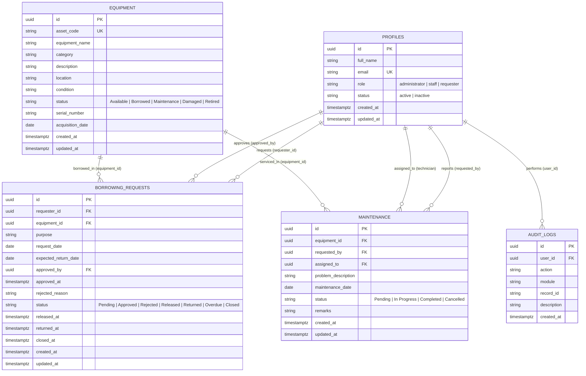

# Entity-Relationship Diagram (ERD) Specification

## Systems Analysis and Design — Laboratory 4, Section A
### Role-Based Asset Transaction and Approval Management

---

## 1. Architectural ERD Overview

The Laboratory Asset and Service Management System database model is implemented on **PostgreSQL / Supabase**. It features strict referential integrity, check constraints, Row Level Security (RLS) policies, and atomic transaction triggers.

---

## 2. Table Schemas and Cardinalities

### 2.1 Table: `profiles`
Stores application-level user attributes linked directly to Supabase Auth `auth.users.id`.

| Field Name | Data Type | Constraints | Description |
| :--- | :--- | :--- | :--- |
| `id` | UUID | PRIMARY KEY, REFERENCES `auth.users(id)` ON DELETE CASCADE | Unique identifier matching authentication record |
| `full_name` | TEXT | NOT NULL | User's complete legal name |
| `email` | TEXT | NOT NULL, UNIQUE | Institutional email address used for credentials |
| `role` | TEXT | NOT NULL, CHECK (`role IN ('administrator', 'staff', 'requester')`) | RBAC role determining permissions |
| `status` | TEXT | NOT NULL, DEFAULT `'active'`, CHECK (`status IN ('active', 'inactive')`) | Account operational state |
| `created_at` | TIMESTAMPTZ | NOT NULL, DEFAULT `now()` | Record creation timestamp |
| `updated_at` | TIMESTAMPTZ | NOT NULL, DEFAULT `now()` | Record modification timestamp |

### 2.2 Table: `equipment`
Maintains hardware assets and laboratory equipment catalog.

| Field Name | Data Type | Constraints | Description |
| :--- | :--- | :--- | :--- |
| `id` | UUID | PRIMARY KEY, DEFAULT `gen_random_uuid()` | Surrogate unique identifier |
| `asset_code` | TEXT | NOT NULL, UNIQUE | University asset tracking code (e.g. `LAP-001`, `PRJ-001`) |
| `equipment_name`| TEXT | NOT NULL | Commercial model name and hardware specs |
| `category` | TEXT | NOT NULL | Classification (`Laptops`, `Projectors`, `Monitors`, etc.) |
| `description` | TEXT | NULLABLE | Detailed specs and included accessories |
| `location` | TEXT | NOT NULL | Physical cabinet, shelf, or laboratory room location |
| `condition` | TEXT | NOT NULL, DEFAULT `'Good'` | Physical wear state (`Good`, `Fair`, `Poor`, `Damaged`) |
| `status` | TEXT | NOT NULL, DEFAULT `'Available'`, CHECK (`status IN ('Available', 'Borrowed', 'Maintenance', 'Damaged', 'Retired')`) | Transactional state for borrowing availability |
| `serial_number` | TEXT | NULLABLE | Manufacturer serial number |
| `acquisition_date`| DATE | DEFAULT `CURRENT_DATE` | Procurement date |
| `created_at` | TIMESTAMPTZ | NOT NULL, DEFAULT `now()` | System timestamp |
| `updated_at` | TIMESTAMPTZ | NOT NULL, DEFAULT `now()` | System timestamp |

### 2.3 Table: `borrowing_requests`
Encapsulates transaction state-machine for borrowing, approval, release, and return.

| Field Name | Data Type | Constraints | Description |
| :--- | :--- | :--- | :--- |
| `id` | UUID | PRIMARY KEY, DEFAULT `gen_random_uuid()` | Transaction identifier |
| `requester_id` | UUID | NOT NULL, REFERENCES `profiles(id)` ON DELETE RESTRICT | Account requesting the asset |
| `equipment_id` | UUID | NOT NULL, REFERENCES `equipment(id)` ON DELETE RESTRICT | Target equipment asset |
| `purpose` | TEXT | NOT NULL | Academic/research rationale |
| `request_date` | DATE | NOT NULL, DEFAULT `CURRENT_DATE` | Submission date |
| `expected_return_date` | DATE | NOT NULL | Anticipated return date |
| `approved_by` | UUID | NULLABLE, REFERENCES `profiles(id)` ON DELETE SET NULL | Administrator who authorized request |
| `approved_at` | TIMESTAMPTZ | NULLABLE | Approval timestamp |
| `rejected_reason` | TEXT | NULLABLE | Mandatory reason when status is Rejected |
| `status` | TEXT | NOT NULL, DEFAULT `'Pending'`, CHECK (`status IN ('Pending', 'Approved', 'Rejected', 'Released', 'Returned', 'Overdue', 'Closed')`) | State machine position |
| `released_at` | TIMESTAMPTZ | NULLABLE | Timestamp when equipment handed over |
| `returned_at` | TIMESTAMPTZ | NULLABLE | Timestamp when equipment returned to lab |
| `closed_at` | TIMESTAMPTZ | NULLABLE | Final archive timestamp |
| `created_at` | TIMESTAMPTZ | NOT NULL, DEFAULT `now()` | System timestamp |
| `updated_at` | TIMESTAMPTZ | NOT NULL, DEFAULT `now()` | System timestamp |

### 2.4 Table: `maintenance`
Tracks equipment maintenance, repair tickets, and technician work orders.

| Field Name | Data Type | Constraints | Description |
| :--- | :--- | :--- | :--- |
| `id` | UUID | PRIMARY KEY, DEFAULT `gen_random_uuid()` | Work order identifier |
| `equipment_id` | UUID | NOT NULL, REFERENCES `equipment(id)` ON DELETE RESTRICT | Serviced equipment asset |
| `requested_by` | UUID | NOT NULL, REFERENCES `profiles(id)` ON DELETE RESTRICT | Person reporting fault |
| `assigned_to` | UUID | NULLABLE, REFERENCES `profiles(id)` ON DELETE SET NULL | Assigned staff/technician |
| `problem_description` | TEXT | NOT NULL | Diagnosis or fault symptoms |
| `maintenance_date`| DATE | NOT NULL, DEFAULT `CURRENT_DATE` | Date ticket opened |
| `status` | TEXT | NOT NULL, DEFAULT `'Pending'`, CHECK (`status IN ('Pending', 'In Progress', 'Completed', 'Cancelled')`) | Maintenance lifecycle state |
| `remarks` | TEXT | NULLABLE | Technician diagnostic and repair notes |
| `created_at` | TIMESTAMPTZ | NOT NULL, DEFAULT `now()` | System timestamp |
| `updated_at` | TIMESTAMPTZ | NOT NULL, DEFAULT `now()` | System timestamp |

### 2.5 Table: `audit_logs`
Immutable append-only audit trail recording all sensitive operations.

| Field Name | Data Type | Constraints | Description |
| :--- | :--- | :--- | :--- |
| `id` | UUID | PRIMARY KEY, DEFAULT `gen_random_uuid()` | Audit log identifier |
| `user_id` | UUID | NULLABLE, REFERENCES `profiles(id)` ON DELETE SET NULL | Authenticated user responsible |
| `action` | TEXT | NOT NULL | Action opcode (e.g. `APPROVED`, `RELEASED`) |
| `module` | TEXT | NOT NULL | Subsystem (`Borrowing`, `Equipment`, etc.) |
| `record_id` | TEXT | NULLABLE | Affected entity record key |
| `description` | TEXT | NOT NULL | Human-readable audit narrative |
| `created_at` | TIMESTAMPTZ | NOT NULL, DEFAULT `now()` | Tamper-evident timestamp |

---

## 3. Referential Cardinalities and Business Integrity

1. **`profiles` to `borrowing_requests` (1:N)**:
   - A requester can submit multiple borrowing requests over time.
   - An administrator can approve multiple borrowing requests.
2. **`equipment` to `borrowing_requests` (1:N)**:
   - An equipment asset can be borrowed across multiple historical transactions, but only one active transaction (`Released` or `Overdue`) can exist concurrently (enforced by BR-A4-01 & BR-A4-05).
3. **`equipment` to `maintenance` (1:N)**:
   - An equipment asset can undergo multiple maintenance cycles over its operational lifetime.
4. **`profiles` to `audit_logs` (1:N)**:
   - Every sensitive administrative, staff, and requester transaction links to the acting user's profile.
