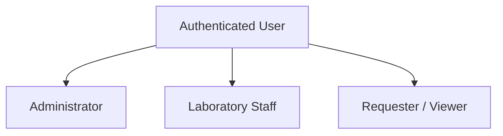
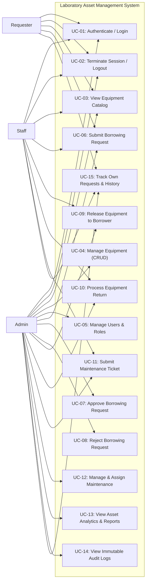

# Use Case Specification

## Systems Analysis and Design — Laboratory 4, Section A
### Role-Based Asset Transaction and Approval Management

---

## 1. Actor Hierarchy

### 1.1 Actor Definitions

1. **Administrator (`administrator`)**:
   Responsible for executive laboratory governance, user account provisioning, equipment procurement, official borrowing authorizations (approvals and rejections), work order assignments, audit trail monitoring, and system metrics inspection.
2. **Laboratory Staff (`staff`)**:
   Responsible for daily operational handovers: equipment catalog verification, dispatching physically approved equipment (`Release`), inspecting returned hardware and assessing wear/damage (`Return`), and flagging defective assets (`Maintenance`).
3. **Requester / Viewer (`requester`)**:
   Students, faculty, or researchers who browse available equipment, submit borrowing requests for academic coursework, track live approval statuses, and review personal borrowing histories.

---

## 2. Use Case Diagram

---

## 3. Detailed Use Case Specifications

### UC-07: Approve Borrowing Request
- **Primary Actor**: Administrator
- **Preconditions**:
  1. Administrator is authenticated.
  2. Borrowing request exists with status `Pending`.
  3. Equipment status is `Available`.
- **Main Flow**:
  1. Administrator navigates to Borrowing Requests page.
  2. System displays pending requests with requester name, equipment asset, and intended dates.
  3. Administrator clicks **Approve**.
  4. System prompts confirmation dialog.
  5. System validates BR-A4-02 (staff cannot approve own request) and BR-A4-03 (only admin approves).
  6. System updates request status to `Approved` and timestamps `approved_at` with `approved_by = current_user_id`.
  7. System records `APPROVED` entry in `audit_logs` (BR-A4-10).
  8. Interface displays green success toast and refreshes data table.
- **Postconditions**: Request is ready for physical release. Equipment remains Available until released.

### UC-08: Reject Borrowing Request
- **Primary Actor**: Administrator
- **Preconditions**:
  1. Administrator is authenticated.
  2. Borrowing request exists with status `Pending`.
- **Main Flow**:
  1. Administrator clicks **Reject** on a pending request.
  2. System presents a mandatory rejection modal requesting justification.
  3. Administrator enters rationale (e.g. *"Equipment reserved for scheduled lab practical"*).
  4. Administrator confirms rejection.
  5. System updates request status to `Rejected` and persists `rejected_reason`.
  6. System records `REJECTED` entry in `audit_logs`.
- **Postconditions**: Request is permanently rejected. It cannot be released (BR-A4-07).

### UC-09: Release Equipment to Borrower
- **Primary Actor**: Administrator or Laboratory Staff
- **Preconditions**:
  1. User is authenticated with role `administrator` or `staff`.
  2. Borrowing request is in `Approved` status (BR-A4-04).
  3. Equipment status is `Available`.
- **Main Flow**:
  1. Staff verifies borrower's physical identity at laboratory counter.
  2. Staff clicks **Release** on the approved transaction.
  3. System triggers atomic state transition (BR-A4-05):
     - `borrowing_requests.status` becomes `Released`
     - `equipment.status` becomes `Borrowed`
  4. System records `RELEASED` in `audit_logs`.
- **Postconditions**: Equipment is in borrower's custody and blocked from any new borrowing requests.

### UC-10: Process Equipment Return
- **Primary Actor**: Administrator or Laboratory Staff
- **Preconditions**:
  1. Request is currently in `Released` or `Overdue` status.
- **Main Flow**:
  1. Staff inspects returned hardware, power adapters, and accessories.
  2. Staff opens Return modal and selects condition:
     - **Good**: Hardware operates normally. `equipment.status` reverts to `Available`.
     - **Damaged**: Hardware broken or missing parts. `equipment.status` transitions to `Damaged`.
  3. Staff inputs diagnostic inspection remarks.
  4. Staff submits return.
  5. System verifies transaction has not already been returned (BR-A4-08).
  6. System sets `borrowing_requests.status` to `Returned` and records `RETURNED` in `audit_logs`.
- **Postconditions**: Transaction is closed. Equipment availability reflects physical condition.
