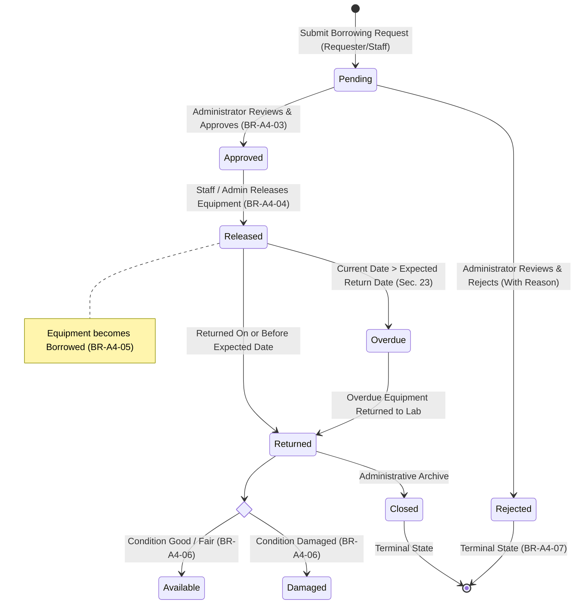

# Transaction Lifecycle & State Transition Workflow

## Systems Analysis and Design — Laboratory 4, Section A
### Role-Based Asset Transaction and Approval Management

---

## 1. Complete Workflow Diagram

The diagram below illustrates the exact state transition lifecycle required by Laboratory 4, Section 12 and Section 41.

---

## 2. Permitted vs. Illegal State Transitions

The state-machine trigger `trg_borrowing_state_machine` and client controllers rigorously validate every transition against this state chart. Arbitrary client status mutations are unconditionally rejected by database exceptions.

| Initial State | Target State | Validity | Actor Required | Side Effects / Invariants |
| :--- | :--- | :---: | :--- | :--- |
| *New* | `Pending` | **VALID** | Requester, Staff, Admin | Equipment must be `Available`. Timestamp `created_at` recorded. |
| `Pending` | `Approved` | **VALID** | Administrator Only | Records `approved_by` and `approved_at`. Audit: `APPROVED`. |
| `Pending` | `Rejected` | **VALID** | Administrator Only | Requires non-empty `rejected_reason`. Audit: `REJECTED`. |
| `Pending` | `Released` | ❌ **INVALID** | — | **BR-A4-04 Violation**: Only Approved requests can be released. |
| `Pending` | `Returned` | ❌ **INVALID** | — | Equipment was never released. |
| `Approved` | `Released` | **VALID** | Staff or Administrator | Equipment status atomically updates to `Borrowed` (BR-A4-05). |
| `Approved` | `Returned` | ❌ **INVALID** | — | Hardware must be released prior to return. |
| `Rejected` | `Released` | ❌ **INVALID** | — | **BR-A4-07 Violation**: Rejected requests cannot be released. |
| `Released` | `Returned` | **VALID** | Staff or Administrator | Checks condition: if Damaged -> `Damaged`, else -> `Available`. |
| `Released` | `Overdue` | **VALID** | System Timer / Clock | Triggered when `expected_return_date < CURRENT_DATE`. |
| `Overdue` | `Returned` | **VALID** | Staff or Administrator | Clears overdue flag; updates hardware condition. |
| `Returned` | `Returned` | ❌ **INVALID** | — | **BR-A4-08 Violation**: Duplicate return processing strictly blocked. |
| `Returned` | `Released` | ❌ **INVALID** | — | Cannot re-release an already returned transaction. |
| `Returned` | `Closed` | **VALID** | Administrator | Finalizes transaction. |
| `Closed` | *Any State* | ❌ **INVALID** | — | Closed transactions are immutable historical records. |

---

## 3. Atomic Synchronization Mechanics

### 3.1 Handover Execution (`Approved -> Released`)
When the laboratory staff dispenses physical equipment, the system executes an atomic transaction:
1. `borrowing_requests.status` is set to `Released`.
2. `borrowing_requests.released_at` is stamped with current system time.
3. `equipment.status` is transitioned from `Available` to `Borrowed`.
4. Audit log entry `RELEASED` is appended.

If either the request update or equipment update fails, the entire transaction is rolled back, preventing orphaned equipment states.

### 3.2 Return Execution (`Released/Overdue -> Returned`)
When physical hardware is returned to the counter:
1. System verifies current status is `Released` or `Overdue`.
2. Hardware inspection occurs:
   - If returned in working condition: `equipment.status = Available`.
   - If returned damaged or defective: `equipment.status = Damaged`.
3. `borrowing_requests.status` is set to `Returned`.
4. `borrowing_requests.returned_at` is stamped.
5. Audit log entry `RETURNED` is generated with condition details and technician remarks.
